[Up](index.md)

# 컴퓨터 비전을 위한 데이터셋

## [LAG: Large Age Gap](http://www.ivl.disco.unimib.it/activities/large-age-gap-face-verification/):

어린이, 성인, 노인에 이르기까지 다양한 이미지와 함께 다양한 연령대가 포함된 데이터셋입니다. 이 데이터 세트에는 1,028명의 유명인 3,828 개의 이미지가 포함되어 있습니다. 각 신원에 대해 하나 이상의 아동, 성인, 노인 이미지가 있습니다.

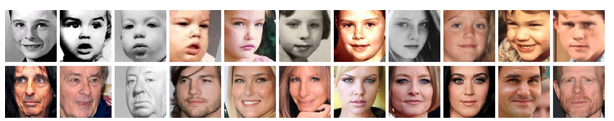

## [Labelme](http://labelme.csail.mit.edu/Release3.0/browserTools/php/dataset.php):

MIT Computer Science and Artificial  Intelligence Laboratory (CSAIL) 에 의해 제작되었고, 187,240개의 이미지와 62,197 주석된 이미지, 658,992개의 라벨링된 개체로 구성되었습니다.

## [Lego Bricks (Kaggle)](https://www.kaggle.com/joosthazelzet/lego-brick-images):

폴더별로 분류 된 16 가지 레고 블록과 블렌더를 사용하여 렌더링 한 컴퓨터의 6400 이미지가 포함되어 있습니다.

## [ImageNet](http://image-net.org/):

새로운 알고리즘을 위한 de-facto 이미지 데이터셋. 계층 구조의 각 노드가 수백, 수천 개의 이미지로 표시되는 WordNet 계층 구조에 따라 구성되어 있습니다.

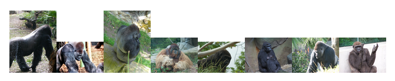

## [LSUN](http://lsun.cs.princeton.edu/2016/):

많은 부수적인 태스크 (공간 레이아웃 추정, 돌출 성 예측 등)를 이해하기 위한 씬 이미지들입니다. [Paper](https://arxiv.org/abs/1506.03365)

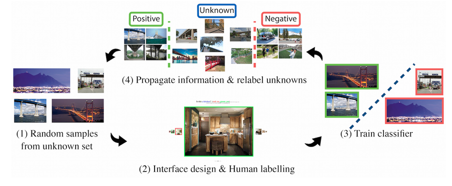

출처: https://www.yf.io/p/lsun

## [MS COCO](http://mscoco.org/):

COCO는 대규모 개체 인식, 세그먼테이션 및 자막 데이터 집합입니다. 개체 세그먼테이션, 문맥 인식, 수퍼픽셀 세그먼테이션으로 330,000개의 이미지, 200,000개의 레이블, 1,500,000개의 개체 인스턴스, 80개의 개체 카테고리, 91개의 stuff 카테고리, 이미지당 5개의 캡션을, 250,000명의 사람과 키포인트를 가지고 있습니다. [Paper](https://arxiv.org/abs/1405.0312), [Python API](https://github.com/cocodataset/cocoapi/blob/master/PythonAPI/pycocotools/coco.py)

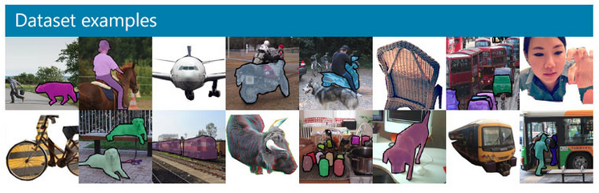

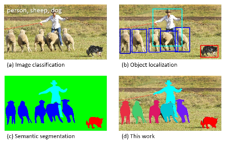

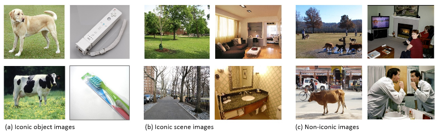

## [COIL100 ](http://www1.cs.columbia.edu/CAVE/software/softlib/coil-100.php):

360도 회전으로 모든 각도에서 100 개의 다른 물체를 촬영했습니다. [Paper](http://citeseerx.ist.psu.edu/viewdoc/download?doi=10.1.1.360.6420&rep=rep1&type=pdf)

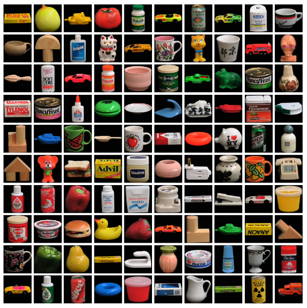

## [Facial Expression Research Group Database (FERG-DB)](http://grail.cs.washington.edu/projects/deepexpr/ferg-db.html)

FERG-DB는 표정 주석이 붙은 캐릭터 데이터베이스입니다. 데이터베이스에는 6개의 양식화 된 문자로 구성된 여러 얼굴 이미지가 들어 있습니다. 캐릭터는 MAYA소프트웨어를 사용하여 모델링되었고 2D로 렌더링되어 이미지를 만들었습니다. 데이터베이스에는 6 개의 양식 된 문자의 표정 이미지가 포함되어 있습니다. 각 캐릭터의 이미지는 분노, 혐오감, 두려움, 기쁨, 중립, 슬픔 및 놀라움의 7 가지 유형으로 그룹화됩니다.

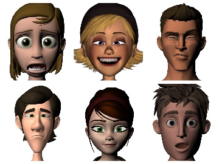

## [Visual Genome](http://visualgenome.org/):

캡션이 달린 매우 상세한 시각적 지식 베이스를 위한 100,000개의 이미지들 입니다.

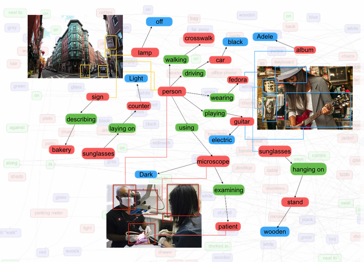

## [Google’s Open Images](https://research.googleblog.com/2016/09/introducing-open-images-dataset.html):

크리에이티브 커먼즈 (Creative Commons)의 "6,000 개가 넘는 레이블에 주석이 달린" 이미지에 9 백만 개의 URL 모음입니다.

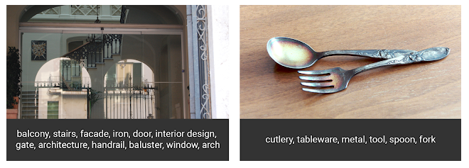

## [Youtube-8M](https://research.google.com/youtube8m/index.html):

수백 개의 YouTube 동영상 ID와 3,800 개가 넘는 시각적 개체로 구성된 대규모 라벨 데이터 세트입니다.

## [DAVIS: Densely Annotated VIdeo Segmentation](https://davischallenge.org/)

DAVIS (Densely Annotated VIdeo Segmentation)는 오클루전, 모션 블러 및 모양 변경과 같은 공통 비디오 객체 세분화 문제가 여러 번 발생하는 50개의 고품질 풀 HD 비디오 시퀀스로 구성됩니다. 각 비디오는 조밀한 주석을 달고, 픽셀 단위로 정확한 프레임 단위의 Ground truth 분할을 가지고 있습니다.

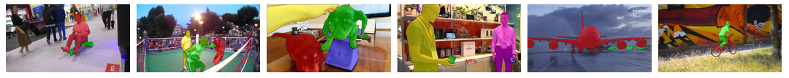

## [Labelled Faces in the Wild](http://vis-www.cs.umass.edu/lfw/):

얼굴 인식을 포함하는 응용 프로그램을 개발할 때 사용하기 위해 인간 얼굴의 13,000 개의 라벨링된 이미지입니다.

## [Stanford Dogs Dataset: ](http://vision.stanford.edu/aditya86/ImageNetDogs/)

20,580 개의 이미지와 120 개의 다른 개 유형을 포함합니다.

## [FIRE: Fundus Image Registration Dataset](https://www.ics.forth.gr/cvrl/fire/)

이 데이터셋은 134 개의 이미지 쌍을 형성하는 129 개의 망막 이미지로 구성 되어 있습니다. 특성에 따라 3 가지 카테고리로 나뉩니다. 이미지는 Nidek AFC-210 안저 카메라로 촬영되었으며,이 카메라는 x와 y 차원에서 2912x2912 픽셀의 해상도와 45°의 FOV 해상도로 이미지를 수집합니다.

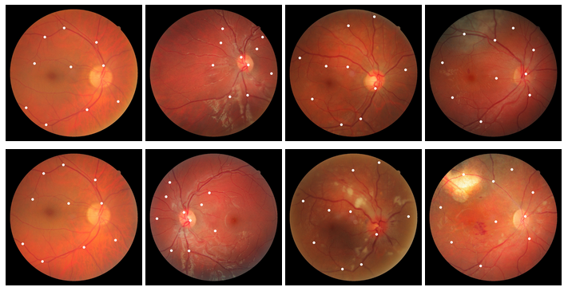

## [Places](http://places.csail.mit.edu/index.html):

205 개의 장면 범주와 250 만 개의 범주 레이블이있는 장면 중심 데이터베이스입니다.

## [00 Videos in the Wild (300-VW) Challenge & Workshop (ICCV 2015)](https://ibug.doc.ic.ac.uk/resources/300-VW/)

Wild (300-VW) 데이터 세트의 300 개 비디오에는 얼굴 표식 추적을 위한 비디오가 포함되어 있습니다. 특히,이 데이터 세트에는 114 개의 비디오가 포함되어 있으며 68 개의 마크 업 랜드 마크 포인트가 주석으로 표시됩니다.

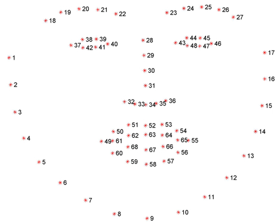

## [CelebFaces](http://mmlab.ie.cuhk.edu.hk/projects/CelebA.html):

200,000 가지가 넘는 유명인 이미지가있는 얼굴 데이터 세트로 각각 40개의 속성 주석이 있습니다.

## [Flowers](http://www.robots.ox.ac.uk/~vgg/data/flowers/102/index.html):

영국에서 흔히 볼 수있는 꽃의 이미지 데이터셋으로 102 가지 카테고리로 구성됩니다.

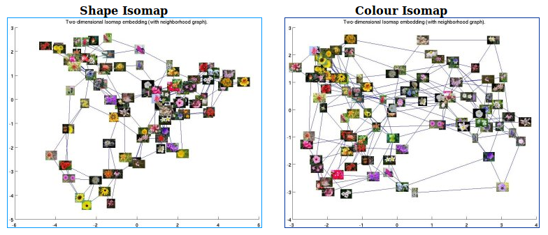

## [Plant Image Analysis](https://www.plant-image-analysis.org/dataset):

1백만개의 식물 이미지 데이터셋으로 11종의 식물 중에서 선택할 수 있습니다.

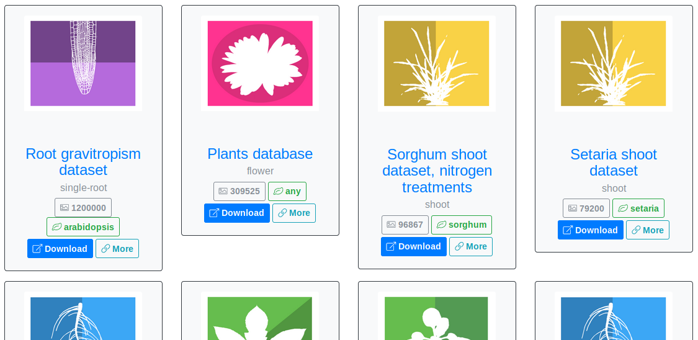

## [Home Objects](http://www.vision.caltech.edu/pmoreels/Datasets/Home_Objects_06/):

주로 부엌, 욕실 및 거실에서 가져온 집안의 임의의 개체가 포함 이미지 데이터셋입니다.

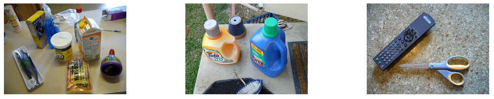

## [CIFAR-10](https://www.cs.toronto.edu/~kriz/cifar.html):

10 클래스로 60,000개의 32 × 32 컬러 이미지를 포함합니다.

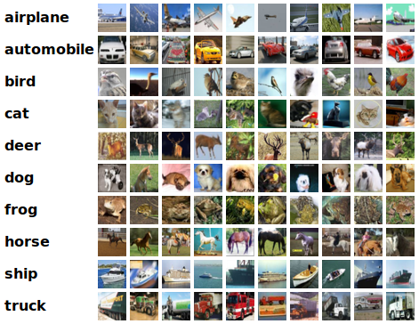

## [CompCars](http://mmlab.ie.cuhk.edu.hk/datasets/comp_cars/index.html):

최대 속도, 변위, 문 개수, 좌석 수 및 차량 유형을 포함하여 각 자동차 모델에 1,716 개의 자동차 모델이 포함 된 163 종의 자동차가 포함 되어 있습니다.

## [Indoor Scene Recognition](http://web.mit.edu/torralba/www/indoor.html):

67개의 실내 카테고리와 총 15,620 개의 이미지가 포함되어 있습니다.

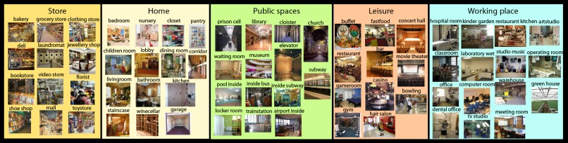

## [VisualQA](http://www.visualqa.org/):

VQA는 265,016 개의 이미지에 대한 자유로운 질문을 포함하는 데이터셋으로 질문 할 때 시각과 언어에 대한 이해가 필요합니다.

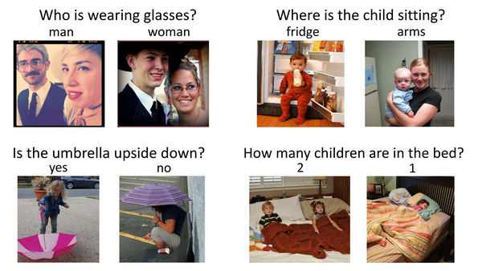

## Change

Change Detection 데이터베이스는 옵티컬 플로 및 스테레오 비전을 위한 Middlebury 데이터 세트와 마찬가지로 변경 및 동작 감지를위한 기존 및 새로운 알고리즘을 테스트하고 순위를 매기기 위해 엄격하고 포괄적인 학업 벤치 마킹 노력을 캡슐화합니다. 새로운 데이터 세트는 2012 년 봄 CVPR 2012 변경 감지 워크샵 과제의 일부로 개발되었으며 학계 및 업계의 피드백을 기반으로 정기적으로 개정되고 확장 될 예정입니다. 이 웹 사이트는 앞으로 수년 동안 포괄적 인 방법 순위를 유지합니다.

[Change Detection Database](http://www.changedetection.net/)

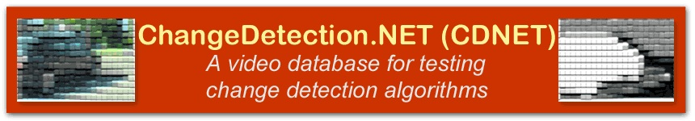

## 3D

[VT-KFER: A Kinect-based RGBD+Time Dataset for Spontaneous and Non-Spontaneous Facial Expression Recognition](http://sufficiency.ece.vt.edu/VT-KFER/)

T-KFER 데이터 세트는 스크립팅 (행동) 시나리오와 스크립트되지 않은 (자발적) 시나리오에서 Kinect 1.0 센서를 사용하여 수집 한 RGBD + 시간 표정 인식 데이터 세트입니다. 이 완전히 주석이 달린 데이터 세트는 10 세에서 30 세까지 다른 피부 색조를 가진 32 명의 피험자 (남성과 여성)에 대한 7 가지 표현 (행복, 슬픔, 놀람, 혐오, 두려움, 분노 및 중립)을 포함합니다. 

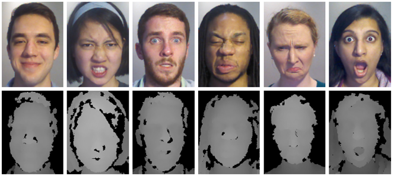

### [The Stanford 3D Scanning Repository](http://www.graphics.stanford.edu/data/3Dscanrep/)

### [Biwi 3D Audiovisual Corpus of Affective Communication](http://www.vision.ee.ethz.ch/datasets/b3dac2.en.html)

코퍼스는 14 명의 원어민 화자 (남성 6 명, 여성 8 명)가 총 1109 개의 문장으로 구성됩니다. 실시간 3D 스캐너와 전문 마이크를 사용하여 얼굴 움직임과 스피커의 음성을 캡처했습니다.

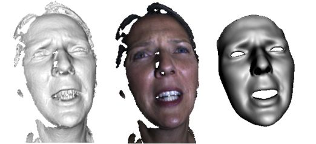

### [Berkeley MHAD](http://tele-immersion.citris-uc.org/berkeley_mhad)

버클리의 MHAD (Multimodal Human Action Database)는 23 세에서 30세 사이의 남성 7명과 여성 5명이 수행하는 11가지 행동을 포함합니다. 모든 피실험자는 각 동작을 5회 반복하여 약 660 회의 동작 시퀀스를 산출했으며 총 녹화 시간은 약 82 분에 해당합니다. 또한, 각 피험자에 대한 T- 포즈가 기록되어 있으며, 이는 골격 추출에 사용될 수 있습니다.

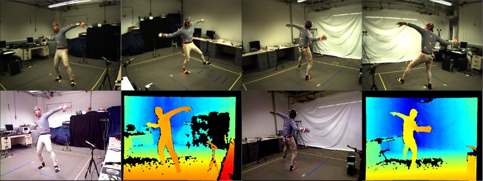

## 참조

- [Computer Vision Online](https://computervisiononline.com/datasets)
- [20 Free Image Datasets for Computer Vision](https://gengo.ai/datasets/20-best-image-datasets-for-computer-vision/)
- [CV Datasets on the Web](http://www.cvpapers.com/datasets.html)
- [Search Engine for Computer Vision Datasets](https://www.visualdata.io/)
- [CVonline: Image Databases](CVonline: Image Databases)
- [Computer Vision Datasets](http://www.cs.utexas.edu/~grauman/courses/spring2008/datasets.htm)