# OpenCV 빌드 방법

*2019년 3월 5일* 반복 설치에 지쳐서 최적의 빌드를 위해 기록으로 정리 합니다.

## 주의

**파일 시스템**

OpenCV를 빌드시 윈도우에 대해 NTFS, 리눅스에 대해 ext4 파일 시스템에서 진행해야 합니다. 다른 파일 시스템에서 설치를 시도하면 CMake가 플러그인을 다운로드 받아 tar 파일을 압축을 해제 하는 과정에서 오류가 발생 합니다.

## 빌드 도구 준비

**Ubuntu 18.04:** 

먼저 빌드 도구를 설치합니다.

```sh
sudo apt update
sudo apt install build-essential
sudo apt install git cmake cmake-gui
```

git을 처음 설치하면 [글로벌 변수를 설정](../git/install_git_on_ubnutu.md)합니다.

## 의존 개발 패키지 설치

**Ubuntu 18.04:**

[eigen3](https://launchpad.net/ubuntu/bionic/+package/libeigen3-dev) 를 설치합니다.

```sh
sudo apt install libeigen3-dev
```

## 소스 다운로드

github.com에서 [opencv](https://github.com/opencv/opencv) 를 다운로드 합니다.

```sh
git clone --recursive https://github.com/opencv/opencv.git
```

다음은 [opencv_contrib](https://github.com/opencv/opencv_contrib)를 다운로드 합니다.

```sh
git clone --recursive https://github.com/opencv/opencv_contrib.git
```

**Windows 10:**

Windows 10에서 빌드한다면 

## cmake-gui를 통한 빌드

opencv는 CMake로 빌드 합니다. CMake 사용법이 궁금하면 [이 글](../c_language/simple_cmake_introduction.md)을 참조 합니다.

### 구성 단계

#### 기본 구성 설정

cmake-gui`를 실행 합니다.

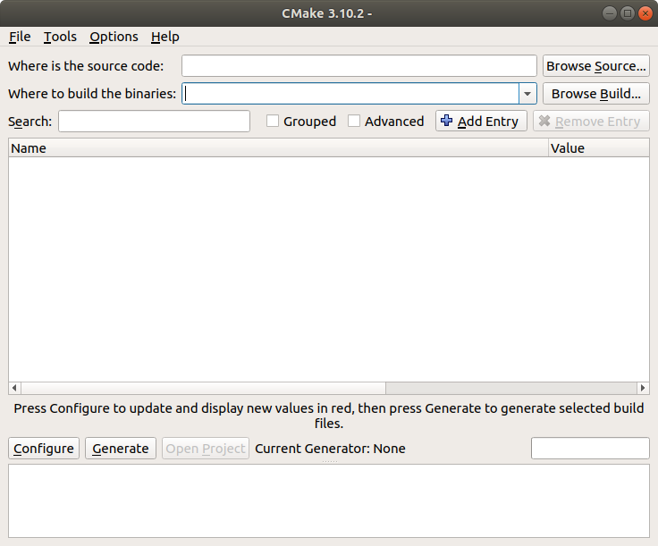

`Browse Source ...` 버튼을 눌러서 다운로드 한  `opencv ` 폴더를 지정해 주고, `Brows Build ...` 버튼을 눌러서 빌드 폴더를 지정해 줍니다. 이 글에서는 opencv 소스코드가 있는 폴더에 `opencv.build.linux`라는 폴더를 지정하였습니다. 해당 경로에 폴더가 없으면 CMake가 생성합니다.

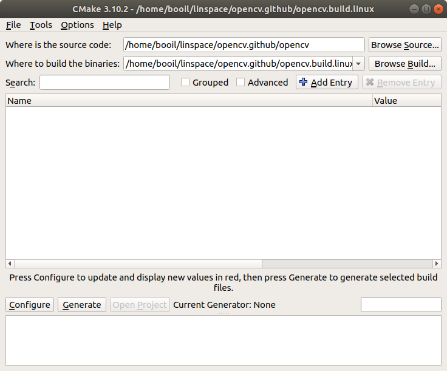

`Configure` 버튼을 누르면 구성을 선택 하는 대화상자가 표시됩니다. 원하는 구성을 선택 합니다.

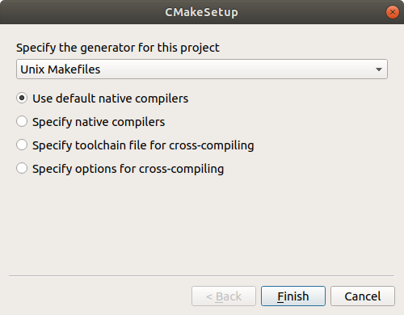

Ninja, Makefile, Visual Studio Solution 등을 선택할 수 있습니다. Windows 10용을 빌드 한다면 Visual Studio Solution을 선택 할 수 있으며, Ubuntu용을 빌드한다면 Unix Makefile을 선택 할 수 있습니다.

여기까지 하면 CMake가 1차 구성을 시작할 것입니다. 구성이 끝나면 Configuring done이 표시되고 빨간색 변수 목록이 나타납니다.

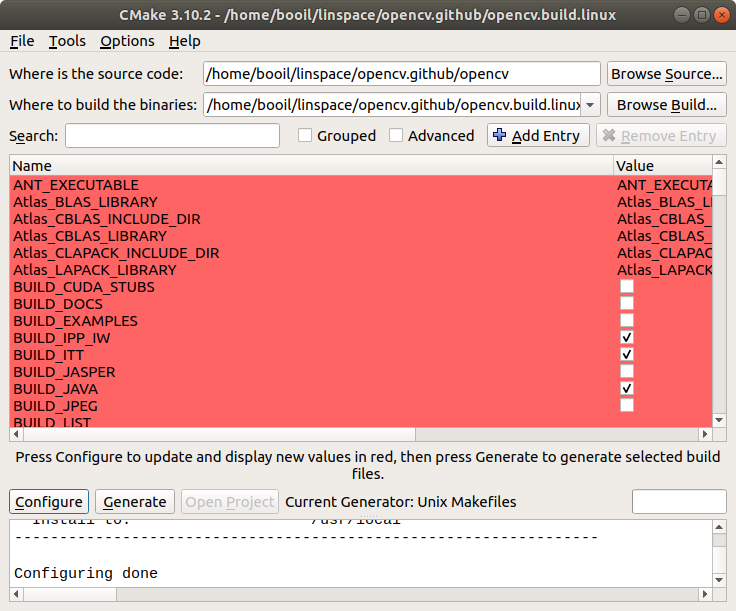

#### 변수 값 지정 (2차 구성)

이 변수 값들을 지정하여 빌드 옵션을 변경할 것입니다. 먼저 중요한 변수들부터 지정합니다.

**Windows 10 전용**

Windows 10에서 빌드한다면 먼저 검색창에 `eigen`을 입력하여 해당 변수들을 찾습니다. `EIGEN_INCLUDE_PATH` 변수에 다운로드한 `libeigen` 경로를 지정합니다. Ubuntu는 해당되지 않습니다.

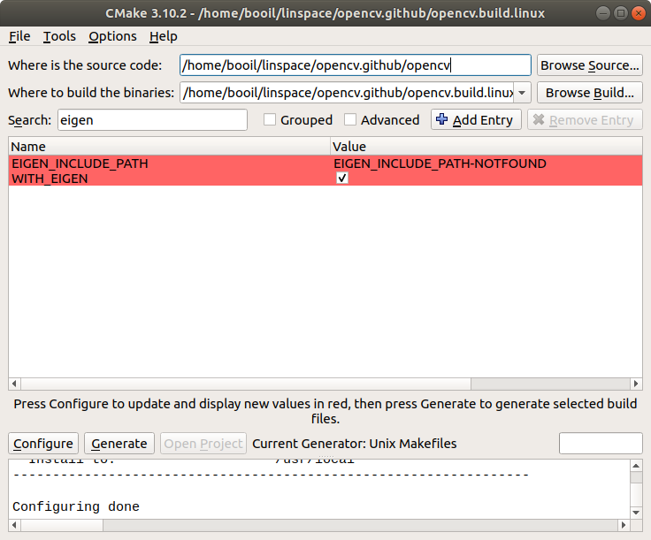

**이하 운영 체제 공통**

**옵션 test**

다음 검색창에 `test`를 입려하여 해당 변수들을 찾습니다. 테스트 관련 모든 변수를 `false`로 지정합니다.

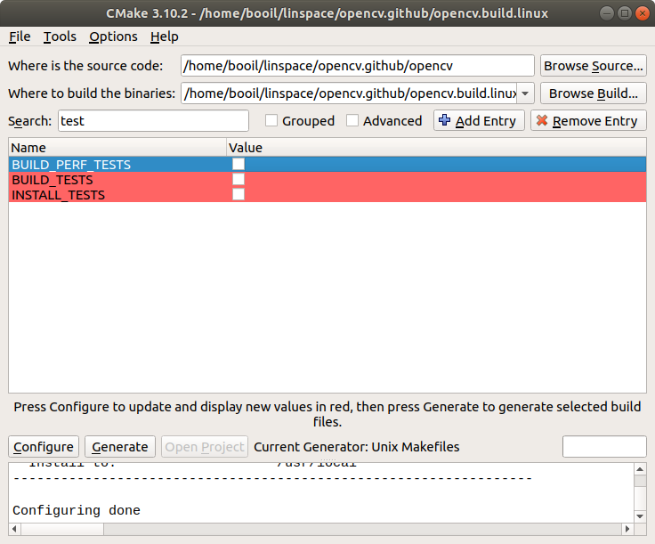

**옵션: extra modules** 

검색창에 `extra`를 입력하여 해당 변수들을 찾습니다. `OPENCV_EXTRA_MODULES_PATH`에 다운로드한 `opencv_contribute` 폴더 안의 `modules` 경로를 지정합니다.

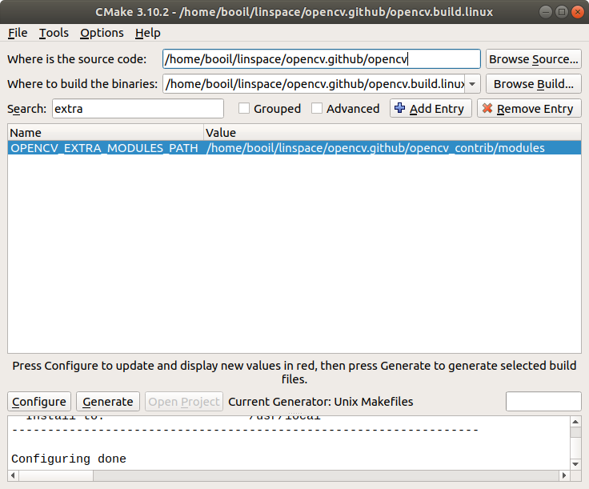

**옵션: nonfree** 

다음 검색창에 `nonfree`를 입력하여 해당 변수들을 찾습니다. `OPENCV_ENABLE_NONFREE` 변수를 `true`로 지정 합니다.

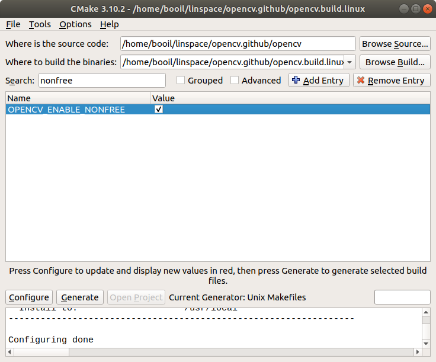

**필수: install.**

다음 검색창에 `install`을 입력하여 해당 변수들을 찾습니다. `CMAKE_INSTALL_PREFIX`의 기본 값은 현재 폴더의 경로입니다. 이것을 원하는 경로로 변경합니다. Unix 운영체제는 기본값이 /us/local 으로 지정할 필요 없지만 빌드 옵션을 두는 경우 선택적으로 지정합니다. Windows 10은 필수로 지정해야 합니다.

필요에 따라 `INSTALL_C_EXAMPLES`등의 변수를 `true`로 지정합니다.

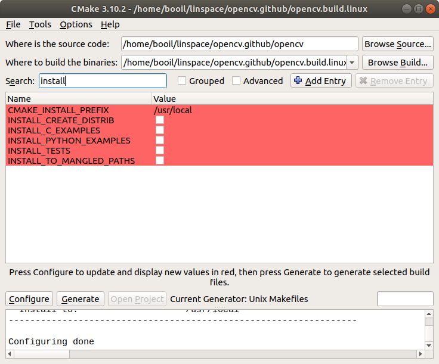

**옵션: build**

다음 검색창에 `build`를 입력하여 빌드할 타겟들을 지정합니다. 빌드 시간을 단축하기 위해 필요 없는 빌드 타겟을 끕니다. `BUILD_opencv_ts`, `BUILD_JAVA`, `BUILD_PACKAGE`를 `false`로 지정 할 수도 있습니다.

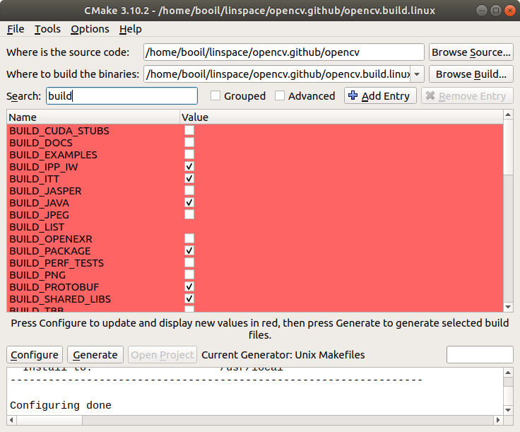

**옵션: 지원**

검색창에 `with`를 입력하여 해당 변수들을 찾습니다. 요즘 1394는 사용하지 않으므로 `WITH_1394` 에 `false`를 지정합니다.

- `WITH_GSTREAMER` 변수에 `false`를 지정합니다.
- `WITH_VTK` 변수에 `false`를 지정합니다.
- `WITH_LAPACK` 변수에 `false`를 지정합니다.

**옵션: world**

라이브러리를 하나의 파일에 통합 할 수도 있습니다. 검색창에 `world`를 입력하여, `BUILD_opencv_world`를 `true`로 지정 합니다.

#### 재구성

변수 값을 변경하였으면 다시 `Configure` 버튼을 눌러서 재구성을 합니다.  `Configuring done.`이 표시되면 재구성이 성공하였습니다.

#### 생성

구성이 끝났으면 `Generate`버튼을 눌러서 Makefile이나 Visual Studio Solution 파일을 생성합니다. 생성이 끝나면 `Generating done.` 이 표시됩니다.

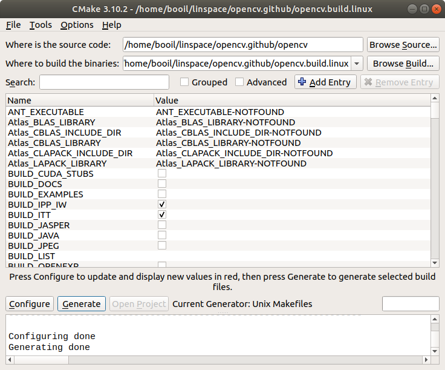

### 빌드 단계

**Makefile**

Ubuntu 를 위해서는 생성된 build 폴더에서 make를 입력하여 빌드 합니다.

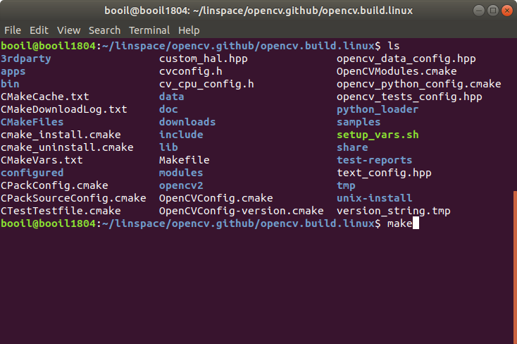

빌드가 끝나면 설치를 합니다.

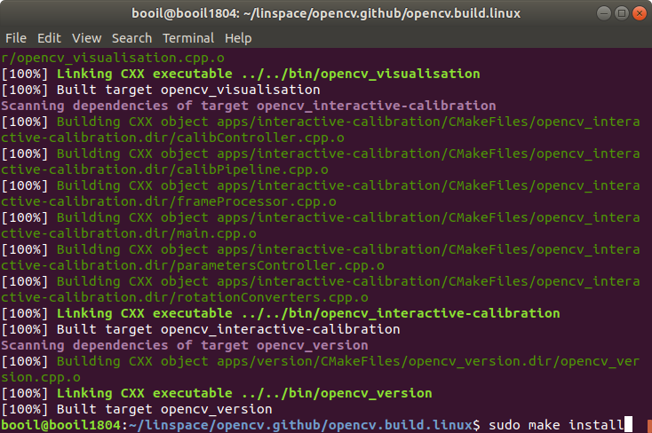

**Visual Studio**

Generating 을 하고나서 `Open Project`  버튼을 누르면 Visual Studio가 솔루션 파일을 오픈합니다.

원하는 빌드 구성을 Debug나 Release중 선택하고, 솔루션 탐색기에서 `CMakeTarget`에서 `INSTALL`에서 콘텍스 메뉴를 표시하여 `빌드` 메뉴를 선택 합니다.

빌드가 완료되면 `OUTPUT` 패인에 `Build: Success: ??, Fail: 0 ...`이 표시 됩니다.

## 참조

- [빌드 동영상 튜토리얼](https://webnautes.tistory.com/1036)