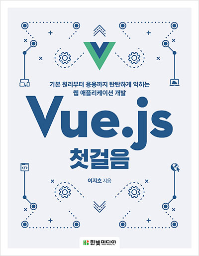

[Top](index.md)

# 책 리뷰: Vue.js 첫걸음

인공지능 프로젝트 서비스를 준비중입니다. 마지막 웹개발은 까마득한 옛날이라, 새로운 웹 프론트엔드를 사용할까 검토하였고, Vue.js가 끌렸습니다. 시간이 부족하기 때문에 빠른 시간에 배우고 적용할 수 있는 프레임워크와 교재가 필요 했습니다. 그래서 선택한 서적이 이지호님이 쓰신 "Vue.js 첫걸음"입니다.



---

과거의 웹 프론트엔드 개발은 자바스크립트와 DOM 처리 방식이 브라우저마다 달라 웹 프론트엔드 개발은 복잡하였습니다. jQuery 나 Underscoer.js 같은 웹 프론트엔드 자바스크립트 라이브러리들의 등장으로 대전환을 하게 됩니다. 이후, Google의 AngularJS를 비롯하여 Backbone.js, React.js, Ember.js, Meteor, MobX, Knockout, Polymer, Riot 등이 등장하게 됩니다.

Vue.js는 Google Creative Labs에서 일하던 Even You가 개발했습니다. view와 발음이 같습니다. 초기의 Vue.js는 Google의 AngularJS로부터 영감을 받았고 유사한 점들이 있습니다. Vue.js는 AngularJS의 복잡도, 유연성 및 모듈성을 해결하기 위해 노력하였습니다. Vue.js는 짧은 시간에 학습이 가능하지만 AngularJS는 그렇지 않습니다.

Vue.js는 기존 HTML 템플릿을 그대로 사용합니다. 그래서 기존 웹 앱에서 Vue.js를 부분적으로 통합하여 사용할 수 있습니다.

웹앱이 CDN을 사용하면 전세계 어디에서든지 낮은 비용으로 균일한 속도를 제공할 수 있습니다. Vue.js는 jQuery처럼 script로 CDN을 바로 추가 할 수 있습니다.

Vue.js는 프레임워크의 모든 것을 통합하지 않고, 필요에 따라 점진적으로 부분만을 통합 하여 사용할 수 있습니다. 예를 들어 Vuex나, Vue-router를 사용하는 경우 입니다.

Vue.js는 컴포넌트들을 별도로 만들고, 적용을 쉽게 추가할 수 있습니다.

다음은 Vue 컴포넌트에 CSS를 통합하는 코드의 예제입니다.

```vue
<style scoped>
@media (min-width: 250px) {
    .list-container:hover {
        background: orange;
    }
}
</style>
```

Vue.js는 경고 및 디버깅을 할 수 있는 개발용 버전 vue.js과 난독화와 크기를 줄인 배포용 버전 vue.min.js를 별도로 제공합니다.

요즘 인기 있는 React.js와 비교해 보자면, 둘다 가상DOM을 사용합니다. 반응적이고 조합 가능한 컴포넌트를 제공합니다. 코어 라이브러리에만 집중하고 있고 라우팅 및 전역 상태를 관리하는 컴패니언 라이브러리가 있습니다. React.js는 생태계 풍부하고 커스텀 렌더러가 풍부합니다. React.js는 학습곡선이 가파른데 비해 Vue.js는 완만합니다. 

React.js는 ReactiveNative를 사용하여 React.js 컴포넌트 모델을 사용하여 모바일 기본 렌더링 앱을 만들 수 있습니다. Vue.js는 NativeScript를 통해 모바일 앱을 만들 수 있습니다. 또 다른 크로스 플랫폼 UI인 Weex를 통해 모바일 앱을 만들 수 있습니다. Weex는 현재 개발중입니다.

React.js는 인스턴스의 데이터를 표현하는 방법으로 HTML을 변형한 JSX를 사용합니다. 표현면에서 효율적이기는 하지만, 별도로 배워야 하므로 학습곡선이 있습니다. 반면에 Vue.js는 기존 HTML 템플릿을 그대로 사용하므로 학습곡선이 완만하며 적은 합습으로도 웹 프론트엔드를 개발 할 수 있습니다.

---

이 책을 통해 Vue.js를 학습 할 수 있었는데 완만하고 풍성한 예제로 Vue.js의 특징들을 경험 할 수 있었습니다.

Vue.js는 뷰와 컴포넌트를 별도로 구분하여 지정합니다. 다음은 HTML에 직접적으로 적용하는 v-text 디렉티브를 사용하는 문자열 보간법 예제입니다.

```vue
<div id="app">
    <span v-text="msg"></span>
</div>
<script>
    new Vue({
        el: "#app"
        data: {
     		msg: "Hello <b>Vue.js</b>"   
    	}
	});
</script>
```

Vue.js에서 반복 렌더링을 하는 방법중 하나로 v-for  디렉티브가 있습니다. 다음은 자바스크립트 배열을 받아 번호 없는 리스트로 출력하는 예제입니다.

```vue
<div id="app">
    <ul>
        <li v-for="n in list">({n})</li>
    </ul>
</div>
<script>
    var app = new Vue({
        e1: "#app",
        data: {
            list: ["Vue.js", "React.js", "Polymer.js", 
"Google", "Hanbit"]
        }
    });
</script>
```

---

연구중인 인공지능 프로젝트 랜딩 페이지를 Vue.js로 개발할 계획이며, 이 입문서는 바쁜 시간에 두껍지 않은 페이지로도 풍부한 예제와 특징들을 안내하여 서비스 준비에 큰 도움이 되었습니다. 좋은 책을 집필하여 주신 지호님께 감사드립니다.


